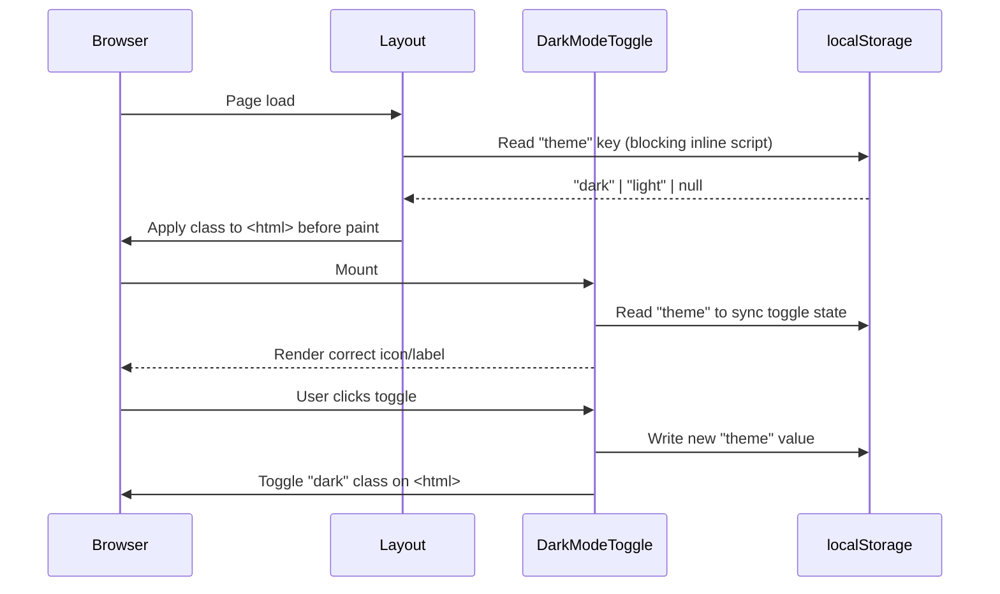

# Design Document — TraceMind AI UI/UX Redesign

## Overview

This document describes the technical design for a comprehensive UI/UX redesign of the TraceMind AI digital forensics platform. The redesign targets visual consistency, accessibility, and polish across every surface: the public landing page, authentication flows, and all authenticated pages (dashboard, cases, admin panel) plus the shared component library (SearchBar, FilterPanel, StatsCard, Sidebar, Topbar).

The platform is built with **Next.js** (App Router), **Tailwind CSS v4**, and **Recharts**. The primary theme is dark navy/black (`#060b18`, `#0d1117`) with blue accents (`#2563eb`). A secondary light theme is supported via a `dark` class on `<html>` toggled by `DarkModeToggle` and persisted to `localStorage`.

### Goals

- Establish a single source of truth for design tokens in `app/globals.css`
- Eliminate per-component hardcoded hex values and unstyled browser defaults
- Achieve WCAG AA contrast in both dark and light themes
- Deliver consistent loading states, micro-interactions, and animation patterns
- Maintain all existing functionality — no API or routing changes

---

## Architecture

The redesign is purely a **presentation layer** change. No backend routes, database schemas, or authentication logic are modified.

```mermaid
graph TD
    A[globals.css — @theme tokens] --> B[Tailwind CSS v4 utility classes]
    B --> C[Shared Components]
    B --> D[Page Components]
    C --> E[SideBar.tsx]
    C --> F[NavBar.tsx]
    C --> G[SearchBar.tsx]
    C --> H[FilterPanel.tsx]
    C --> I[StatsCard.tsx]
    C --> J[DarkModeToggle.tsx]
    D --> K[app/page.tsx — Landing]
    D --> L[app/login|register|... — Auth]
    D --> M[app/dashboard/page.tsx]
    D --> N[app/cases/page.tsx]
    D --> O[app/admin/page.tsx]
    D --> P[components/dashboards/* — 12 Role Dashboards]
```

### Theme Architecture

Dark/light mode is controlled by the `dark` class on `<html>`. Tailwind CSS v4's `dark:` variant applies dark-mode overrides. The `DarkModeToggle` component reads and writes `localStorage["theme"]` and toggles the class. A blocking inline script in `app/layout.tsx` reads `localStorage["theme"]` before the first paint to prevent flash of unstyled content (FOUC).



---

## Components and Interfaces

### Design Token Layer (`app/globals.css`)

The `@theme` block is expanded to cover all semantic color roles, typography, and spacing. Components reference these tokens via Tailwind utility classes rather than hardcoded hex values.

**New token categories:**

| Category | Tokens |
|---|---|
| Background | `--color-bg-base`, `--color-bg-surface`, `--color-bg-elevated` |
| Border | `--color-border-subtle`, `--color-border-default` |
| Text | `--color-text-primary`, `--color-text-secondary`, `--color-text-muted` |
| Accent | `--color-accent`, `--color-accent-hover`, `--color-accent-dark` |
| Status | `--color-status-open`, `--color-status-progress`, `--color-status-closed` |
| Typography | `--text-xs`, `--text-sm`, `--text-base`, `--text-lg` with line-height pairs |
| Spacing | `--spacing-card`, `--spacing-section`, `--spacing-gap`, `--spacing-input` |

### Sidebar (`components/SideBar.tsx`)

**Current issues:** Uses emoji characters as icons; no responsive collapse behavior; no icon-only rail mode.

**Redesigned interface:**

```typescript
interface SidebarProps {
  // No props — reads user from /api/auth/me internally
}

// Internal state additions
interface SidebarState {
  collapsed: boolean;   // icon-only rail mode on < 1024px
  me: Me | null;
  isAdmin: boolean;
  showContact: boolean;
}
```

**Behavior changes:**
- Replace emoji icons with inline SVG components (consistent 20×20 viewBox)
- Add `collapsed` state driven by a `useEffect` that watches `window.innerWidth` with a `ResizeObserver`
- When `collapsed=true`: render `w-16` rail with centered icons and `title` attributes for tooltip behavior; hide text labels
- When `collapsed=false`: render full `w-64` sidebar
- Add `aria-label` to the Sign Out button
- Active state logic unchanged — `bg-blue-600/15 text-blue-400 border border-blue-500/20` for nav, `bg-red-500/15 text-red-400 border border-red-500/20` for admin

### Topbar (`components/NavBar.tsx`)

**Current issues:** No `aria-label` on Sign Out button; breadcrumb mapping is incomplete for dynamic routes.

**Behavior changes:**
- Add `aria-label="Sign out of TraceMind AI"` to the Sign Out button
- Extend breadcrumb map to cover `/admin/audit`, `/admin/training`, `/admin/health`, `/settings`, `/profile`, `/learn`
- Dynamic route segments (e.g. `/cases/[id]`) resolved by reading the last path segment and capitalizing it as a fallback label
- No structural changes — sticky positioning, backdrop-blur, and dark/light background switching are already correct

### SearchBar (`components/SearchBar.tsx`)

**Current issues:** Uses unstyled `border p-2 rounded` classes; no debounce; no search icon; no theme awareness.

**Redesigned interface:**

```typescript
interface SearchBarProps {
  placeholder?: string;
  onSearch: (query: string) => void;
  className?: string;
}
```

**Implementation:**
- Input styling: `bg-white/5 border border-white/10 rounded-xl` (dark) / `bg-white border border-gray-200 rounded-xl` (light) via `dark:` variants
- Left-aligned SVG search icon inside the input using `pl-9` padding and absolute positioning
- Debounce via `useRef` + `setTimeout` (300 ms) — fires `onSearch` on both input change (debounced) and form submit (immediate)
- Remove the separate "Search" button — search triggers automatically

### FilterPanel (`components/FilterPanel.tsx`)

**Current issues:** Uses unstyled `<select>` elements; no `filters` prop; hardcoded options.

**Redesigned interface:**

```typescript
interface FilterOption {
  value: string;
  label: string;
}

interface FilterGroup {
  name: string;
  label: string;
  options: FilterOption[];
}

interface FilterPanelProps {
  filters: FilterGroup[];
  activeFilters: Record<string, string>;
  onFilterChange: (name: string, value: string) => void;
}
```

**Implementation:**
- Replace `<select>` with a row of styled pill buttons per filter group
- Active filter: `bg-blue-600 text-white shadow-md shadow-blue-600/25`
- Inactive filter: `bg-white/5 border border-white/10 text-gray-400 hover:bg-white/10 hover:text-white`
- Each pill button has `type="button"` to prevent accidental form submission

### StatsCard (`components/StatsCard.tsx`)

No interface changes. Visual refinements only:
- Replace emoji `icon` prop rendering with a wrapper that accepts either an emoji string or a React node (SVG), maintaining backward compatibility
- Add `hover:-translate-y-0.5 transition-all duration-300` to the card container (already partially present)

### DarkModeToggle (`components/DarkModeToggle.tsx`)

**Current issues:** Does not read `localStorage` on mount — relies on `document.documentElement.classList` check which can race with the blocking script.

**Fix:** Replace emoji with SVG sun/moon icons; ensure `useEffect` reads `localStorage["theme"]` first, falling back to class check.

### Landing Page (`app/page.tsx`)

**Changes:**
- Replace emoji icons in feature cards with inline SVG icons (one per feature, consistent 24×24 viewBox)
- Add `useIntersectionObserver` hook to trigger count-up animation on Stats bar when section enters viewport
- Navbar mobile menu: add `useState(false)` for `menuOpen`; render hamburger button on `< md` viewports; animate menu open/close with `transition-all`
- All `Link` components already use Next.js client-side navigation — no changes needed for requirement 2.6/2.7
- Preserve all existing gradient-text, animation, and glow classes

### Auth Pages (`app/login`, `app/register`, `app/forgot-password`, `app/reset-password`, `app/verify-email`)

**Current state:** Login page already has the correct two-panel layout and input styling. Register, forgot-password, and reset-password pages need to be audited and aligned.

**Shared pattern to enforce across all auth pages:**
- Two-panel layout: `hidden lg:flex w-[480px]` branding panel + `flex-1 bg-[#0d1117]` form panel
- Input class: `w-full px-4 py-3.5 bg-white/5 border border-white/10 rounded-xl text-white placeholder-gray-600 text-sm focus:outline-none focus:ring-2 focus:ring-blue-500 focus:border-transparent transition`
- Inline validation: `onBlur` handler sets field-level error state; error renders in `<p role="alert" className="text-xs text-red-400 mt-1.5">` within 300 ms (synchronous state update)
- Submit button loading state: `disabled={loading}` + spinner div + descriptive text
- Error banner: `role="alert" aria-live="polite"` on the error container div
- Password visibility toggle button: `aria-label="Show password"` / `aria-label="Hide password"`

### Dashboard Page (`app/dashboard/page.tsx`)

**Changes:**
- Wrap the stats grid in a `Suspense` boundary with skeleton fallback for the server component data fetch
- Add a client-side error boundary component (`DashboardErrorBoundary`) that renders the error state with a Retry button
- Quick Actions section: already present for admin role; add equivalent section to each Role_Dashboard component
- Grid classes: `grid-cols-2 xl:grid-cols-5` already used for admin — verify all role dashboards use the same pattern

### Cases Page (`app/cases/page.tsx`)

The cases page is already well-designed. Targeted changes:
- Replace the inline search input with the redesigned `SearchBar` component
- Replace the inline status filter buttons with the redesigned `FilterPanel` component
- Add `aria-label` to the Delete button: `aria-label={`Delete case ${c.title}`}`
- Add `aria-busy` to the loading state container

### Admin Page (`app/admin/page.tsx`)

Already well-structured. Targeted changes:
- Add `aria-label` to icon-only action buttons
- Ensure the Recently Registered Users table has `<caption>` or `aria-label` on the `<table>` element

---

## Data Models

No new data models are introduced. The redesign operates entirely on existing data shapes returned by the existing API routes.

### Relevant existing types (unchanged)

```typescript
// User shape from /api/auth/me
interface Me {
  name: string;
  role: string;
  email: string;
  avatar?: string | null;
}

// Case shape from /api/cases
interface Case {
  id: string;
  title: string;
  status: "OPEN" | "IN_PROGRESS" | "CLOSED";
  priority: "LOW" | "MEDIUM" | "HIGH" | "CRITICAL";
  type: string;
  createdAt: string;
}

// StatsCard props (unchanged)
interface StatsCardProps {
  title: string;
  value: string | number;
  icon: string;
  color?: "blue" | "green" | "yellow" | "purple" | "red" | "indigo" | "cyan";
  sub?: string;
  trend?: { value: number; label: string };
}
```

### New FilterPanel data shape

```typescript
// Passed as props — no API backing
interface FilterGroup {
  name: string;           // e.g. "status"
  label: string;          // e.g. "Status"
  options: FilterOption[];
}

interface FilterOption {
  value: string;          // e.g. "OPEN"
  label: string;          // e.g. "Open"
}
```

---

## Correctness Properties

*A property is a characteristic or behavior that should hold true across all valid executions of a system — essentially, a formal statement about what the system should do. Properties serve as the bridge between human-readable specifications and machine-verifiable correctness guarantees.*

Property-based testing is applicable here because several requirements express universal behaviors that hold across a range of inputs (all viewport widths, all roles, all nav links, all form states, all theme values). These are well-suited to property-based testing with a library such as [fast-check](https://github.com/dubzzz/fast-check) for TypeScript.

---

### Property 1: No horizontal overflow for any viewport width

*For any* viewport width between 320 px and 1920 px, rendering any platform page SHALL result in `document.documentElement.scrollWidth <= document.documentElement.clientWidth` (no horizontal scrollbar).

**Validates: Requirements 2.1, 10.1**

---

### Property 2: WCAG AA contrast for any text element in either theme

*For any* text element rendered on any platform page in either Dark_Theme or Light_Theme, the computed foreground-to-background contrast ratio SHALL be at least 4.5:1 for normal text (font-size < 18 px or non-bold < 14 px) and at least 3:1 for large text.

**Validates: Requirements 2.9, 3.7, 10.2**

---

### Property 3: Auth input fields have consistent styling across all auth pages

*For any* `<input>` element rendered on any Auth_Page (login, register, forgot-password, reset-password), the element SHALL have the classes `bg-white/5`, `border`, `border-white/10`, `rounded-xl`, and a `focus:ring-2 focus:ring-blue-500` focus style applied.

**Validates: Requirements 3.2**

---

### Property 4: Password strength indicator reflects any password string

*For any* non-empty password string typed into the register page password field, the strength indicator SHALL update its visual state to reflect the computed strength level (weak / fair / strong) within one render cycle.

**Validates: Requirements 3.6**

---

### Property 5: Sidebar active state applies correct classes for any active link

*For any* navigation link in the Sidebar, when the current pathname matches that link's `href`, the link element SHALL have the role-appropriate active state classes applied: `bg-blue-600/15 text-blue-400 border border-blue-500/20` for standard nav links, and `bg-red-500/15 text-red-400 border border-red-500/20` for the Admin Panel link.

**Validates: Requirements 4.2, 4.3**

---

### Property 6: Avatar component falls back to initials for any user without an avatar image

*For any* user object where `avatar` is `null` or `undefined`, the `Avatar` component SHALL render the user's initials (first letter of first name + first letter of last name, uppercased) in place of an `` element.

**Validates: Requirements 4.6**

---

### Property 7: Topbar breadcrumb matches expected trail for any mapped pathname

*For any* pathname that exists as a key in the `breadcrumbs` mapping in `NavBar.tsx`, the rendered breadcrumb trail SHALL display exactly the array of labels defined for that pathname, in order, separated by `/` dividers.

**Validates: Requirements 5.1**

---

### Property 8: Dashboard renders the correct Role_Dashboard for any valid role

*For any* valid role value in the set `{admin, investigator, analyst, security_analyst, auditor, fraud_analyst, trainee, incident_responder, forensic_examiner, threat_hunter, legal_counsel, supervisor, viewer}`, the Dashboard page SHALL render the corresponding Role_Dashboard component and no other role's dashboard.

**Validates: Requirements 6.1**

---

### Property 9: Case badge styles are correct for any status and priority value

*For any* case with any `status` value in `{OPEN, IN_PROGRESS, CLOSED}` and any `priority` value in `{LOW, MEDIUM, HIGH, CRITICAL}`, the rendered status badge SHALL have the CSS classes defined in `statusConfig[status].cls` and the priority badge SHALL have the classes defined in `priorityConfig[priority].cls`.

**Validates: Requirements 7.2**

---

### Property 10: SearchBar input styling matches design system for any active theme

*For any* theme state (Dark_Theme or Light_Theme), the `SearchBar` input element SHALL have `rounded-xl` applied, and in Dark_Theme SHALL have `bg-white/5 border-white/10`, and in Light_Theme SHALL have `bg-white border-gray-200`.

**Validates: Requirements 8.1**

---

### Property 11: SearchBar debounces onSearch callback by 300 ms for any input change

*For any* string typed into the `SearchBar` input, the `onSearch` callback SHALL NOT be called until at least 300 ms have elapsed since the last keystroke (debounce), but SHALL be called immediately on form submit.

**Validates: Requirements 8.3**

---

### Property 12: FilterPanel highlights active filter for any selected option

*For any* filter option in any `FilterGroup`, when that option is the active value for its group, the corresponding pill button SHALL have the classes `bg-blue-600` and `text-white` applied, and all other options in the same group SHALL not have those classes.

**Validates: Requirements 8.6**

---

### Property 13: All icon-only buttons have a non-empty aria-label

*For any* `<button>` element that contains only icon content (SVG or emoji, no visible text node), the button SHALL have a non-empty `aria-label` attribute.

**Validates: Requirements 10.5**

---

### Property 14: Forms set aria-busy during submission for any form

*For any* form on any platform page, while a submission is in progress (loading state is `true`), the submit button SHALL have `aria-busy="true"` and the error message region SHALL have `aria-live="polite"`.

**Validates: Requirements 10.7**

---

### Property 15: Theme toggle persists to localStorage for any toggle action

*For any* toggle action on `DarkModeToggle` (dark→light or light→dark), `localStorage.getItem("theme")` SHALL equal the new theme value (`"light"` or `"dark"`) immediately after the toggle.

**Validates: Requirements 11.1**

---

### Property 16: DarkModeToggle reflects stored theme on mount for any stored value

*For any* value of `localStorage["theme"]` (`"dark"` or `"light"`), the `DarkModeToggle` component SHALL render the correct icon and label on mount without requiring a user interaction.

**Validates: Requirements 11.4**

---

### Property 17: Buttons in loading state show spinner for any button action

*For any* button that has an associated async action in progress, the button's text label SHALL be replaced with a spinner element (`animate-spin` class) and a descriptive loading text string.

**Validates: Requirements 12.2**

---

## Error Handling

### Network Errors on Auth Pages

All auth form submissions are wrapped in `try/catch`. On network failure, a dismissible error banner is rendered with `role="alert"` and `aria-live="polite"`. The banner includes a human-readable message ("Cannot connect to server. Please try again.") and a close button.

### Dashboard Data Fetch Failures

The dashboard uses a server component data fetch. If the fetch throws, the page renders an error state with a "Retry" button that triggers a client-side router refresh (`router.refresh()`). A `DashboardErrorBoundary` client component wraps the role dashboard render to catch client-side errors.

### Cases Page Load Failures

Already handled with an error state and "Retry" button (`window.location.reload()`). No changes needed.

### Missing Breadcrumb Mappings

If a pathname is not in the `breadcrumbs` map, the Topbar falls back to `["TraceMind AI"]`. Dynamic route segments (e.g. `/cases/abc123`) are handled by splitting the pathname and capitalizing the last segment as a fallback label.

### Avatar Image Load Failures

The `Avatar` component already handles missing `src` by rendering initials. An `onError` handler on the `` element sets a local `imgError` state to fall back to initials if the image URL is valid but the image fails to load.

### Theme Initialization

If `localStorage` is unavailable (e.g. private browsing with storage blocked), the blocking inline script catches the exception and defaults to dark theme. The `DarkModeToggle` similarly wraps `localStorage` access in a try/catch.

---

## Testing Strategy

### Dual Testing Approach

Both unit/example-based tests and property-based tests are used. Unit tests cover specific examples, edge cases, and integration points. Property tests verify universal behaviors across generated inputs.

### Property-Based Testing Library

**[fast-check](https://github.com/dubzzz/fast-check)** — TypeScript-native, well-maintained, integrates with Jest/Vitest.

Install: `npm install --save-dev fast-check`

Each property test runs a minimum of **100 iterations**. Each test is tagged with a comment referencing the design property:

```typescript
// Feature: ui-ux-redesign, Property 5: Sidebar active state applies correct classes for any active link
it('applies correct active state for any nav link', () => {
  fc.assert(fc.property(
    fc.constantFrom('/dashboard', '/cases', '/evidence/upload', '/reports'),
    (href) => {
      // ... render and assert
    }
  ), { numRuns: 100 });
});
```

### Unit Tests (Example-Based)

Focused on:
- Auth page two-panel layout at specific breakpoints (1023 px / 1024 px)
- Sidebar collapse behavior at 1023 px
- Dark mode FOUC prevention (blocking script applies class before hydration)
- Empty state rendering on Cases page (no cases / filtered empty)
- Pagination controls appear at total > 20
- Toast notification positioning
- Skeleton loader presence during loading states
- Admin panel grid layouts at specific breakpoints

### Property Tests

One property-based test per correctness property (Properties 1–17 above). Each test:
- Uses `fc.assert(fc.property(...))` with `numRuns: 100`
- Is tagged with `// Feature: ui-ux-redesign, Property N: <property_text>`
- Mocks external dependencies (API calls, `localStorage`, `window.innerWidth`) to keep tests fast and deterministic

### Accessibility Testing

- Automated: `jest-axe` or `@axe-core/react` for WCAG AA contrast and ARIA attribute checks (covers Properties 2, 13, 14)
- Manual: Keyboard navigation walkthrough with Tab/Shift-Tab/Enter/Space on all interactive elements
- Manual: Screen reader testing with VoiceOver (macOS) on auth forms and dashboard

### Visual Regression

- Storybook stories for `SearchBar`, `FilterPanel`, `StatsCard`, `SideBar`, `NavBar` with dark and light theme variants
- Chromatic (or Percy) for visual diff on PR — catches unintended style regressions

### Lighthouse CI

- Configured in CI pipeline to enforce Lighthouse performance score ≥ 80 on the landing page (Requirement 2.8)
- Run against production build (`next build && next start`) not dev server
